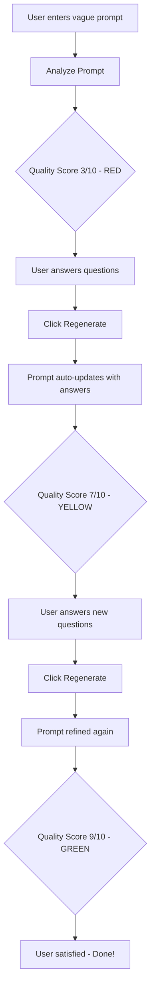

# Quality Score & Prompt Refinement Implementation

## Summary

Enhanced the Prompt Optimizer extension with two major features:
1. **Quality Score Display** - Shows a 1-10 quality rating with color-coded badges
2. **Automatic Prompt Refinement** - Updates the prompt text with improved versions based on user answers

## Changes Made

### Backend: [background.js](file:///c:/Users/danie/OneDrive/Documents/15.%20Google%20Antigravity/Prompt%20Optimizer%20Extension/background.js)

**Lines 58-86: Enhanced System Prompt**
- Added instructions for Claude to provide a quality score (1-10)
  - 1-4 = Poor (vague, risky prompts)
  - 5-7 = Moderate (usable but needs improvement)
  - 8-10 = Excellent (clear, specific, safe)
- Added requirement to generate improved prompts when user answers are provided
- Updated JSON response structure to include:
  ```json
  {
    "qualityScore": 5,
    "improvedPrompt": "Enhanced version with answers incorporated"
  }
  ```

---

### Frontend: [popup.js](file:///c:/Users/danie/OneDrive/Documents/15.%20Google%20Antigravity/Prompt%20Optimizer%20Extension/popup.js)

**Lines 19-30: Added Quality Score Storage**
- Extended storage retrieval to include `savedQualityScore`
- Restores quality score when popup reopens

**Lines 143-151: Automatic Prompt Update**
- When Claude returns an improved prompt, automatically updates the textarea
- Persists the improved prompt to storage
- User sees their prompt evolve through iterations

**Lines 158-165: Quality Score Persistence**
- Saves quality score along with analysis results
- Enables quality score to persist across browser sessions

**Lines 200-213: Quality Badge Rendering**
- Creates quality badge with score text (e.g., "Quality: 6/10")
- Applies color coding based on score:
  - Red: scores 1-4 (poor quality)
  - Yellow/Orange: scores 5-7 (moderate quality)
  - Green: scores 8-10 (excellent quality)

**Line 333: Clear Quality Score**
- Removes `savedQualityScore` when Clear button is clicked

---

### Styles: [popup.css](file:///c:/Users/danie/OneDrive/Documents/15.%20Google%20Antigravity/Prompt%20Optimizer%20Extension/popup.css)

**Lines 216-245: Quality Badge Styles**
- Base `.quality-badge` styles with rounded corners and spacing
- `.quality-low` - Red background for poor prompts (scores 1-4)
- `.quality-medium` - Orange background for moderate prompts (scores 5-7)
- `.quality-high` - Green background for excellent prompts (scores 8-10)

---

## How It Works

### Iterative Refinement Workflow



### Example Progression

**Iteration 1:**
```
Prompt: "make me a website"
Quality: 3/10 🔴
```

**Iteration 2 (after answering questions):**
```
Prompt: "Create a responsive e-commerce website for selling handmade jewelry, 
with product catalog, shopping cart, and payment integration using Stripe"
Quality: 7/10 🟡
```

**Iteration 3 (after more refinement):**
```
Prompt: "Create a mobile-responsive e-commerce website for selling handmade jewelry.
Include: product catalog with filtering (by material, price, style), shopping cart with
real-time updates, Stripe payment integration, user accounts, order history. Tech stack:
React frontend, Node.js/Express backend, PostgreSQL database. Design: minimalist aesthetic
with earth tones, high-quality product photography."
Quality: 9/10 🟢
```

---

## Manual Testing

### Test 1: Initial Analysis
1. Enter prompt: "make me a website"
2. Click "Analyze Prompt"
3. ✅ Quality badge appears (expect score 2-4, red color)
4. ✅ Risk badge shows appropriately
5. ✅ Questions are displayed

### Test 2: Prompt Auto-Update
1. Answer 2-3 questions with specific details
2. Click "Regenerate with Answers"
3. ✅ Prompt textarea updates with improved version
4. ✅ Quality score increases (expect 5-7, yellow/orange)
5. ✅ New questions appear
6✅ Old answers are cleared

### Test 3: Iterative Refinement
1. Continue from Test 2
2. Answer the new questions
3. Click "Regenerate with Answers" again
4. ✅ Prompt updates again, more detailed
5. ✅ Quality score increases further (expect 8-10, green)
6. ✅ Badge color changes to green

### Test 4: Persistence
1. Complete an analysis with quality score showing
2. Close the extension popup
3. Reopen the popup
4. ✅ Quality badge still visible
5. ✅ Improved prompt persists in textarea
6. ✅ Analysis results remain

### Test 5: Clear Everything
1. With analysis and quality score showing
2. Click "Clear" button
3. ✅ Quality badge disappears
4. ✅ Prompt textarea is empty
5. ✅ Analysis results cleared
6. Close and reopen
7. ✅ Everything stays cleared

---

## Benefits

🎯 **Guided Improvement** - Quality score shows users when their prompt is good enough  
🔄 **Iterative Refinement** - Each regeneration improves the prompt automatically  
👁️ **Visual Feedback** - Color-coded badges make quality instantly recognizable  
💾 **Persistent Progress** - Work is never lost across sessions  
🎓 **Learning Tool** - Users learn what makes a good prompt by seeing improvements
